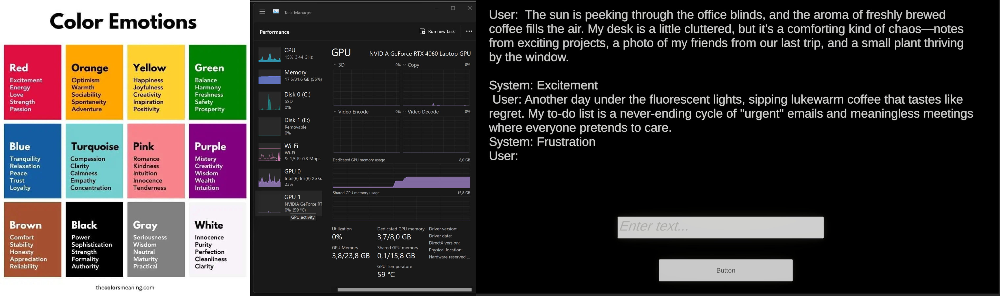

## Install
I didn't use git lts in this project, to correct work this project you need add  packages and model. 

[Asset/Packages folder](https://drive.google.com/file/d/1ie226STB-zQ6XNUy4IamD-8kJ1I0hnPf/view?usp=drive_link)

[Model add to StreamingAssets  folder](https://drive.google.com/file/d/1YmELDPlNX9xzJ8OP7RfeYoEhFlM6XEIm/view?usp=drive_link)

## Try Demo
You can download build to win here:
[Win Build](https://drive.google.com/drive/folders/10puReNa_qN-AO95LjGRD8pjBFIs_SsGd?usp=drive_link)

## Description:
This demo is strat of my technical research about use language ai models in interactive installation and games. 
I take small Llama model to analyze user text about emotion state.
And connect it with simple conundrum mechanic where player need to write text with assigned emotion to control abstract form state and progress to next level. 

## Credits
Technical artist / developer / sound designer / ui designer - Danil Matvienko 

Tech support - uncleboarow 

Art direction - Elisabeth Ros

Special thanks - kalectica

## Development process 

    
